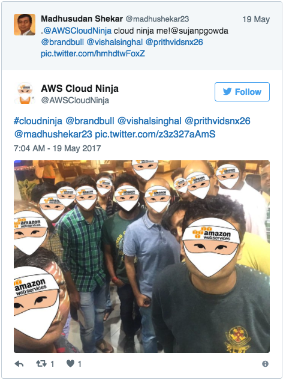
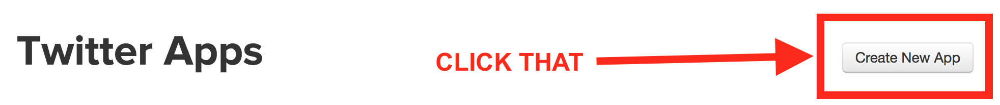
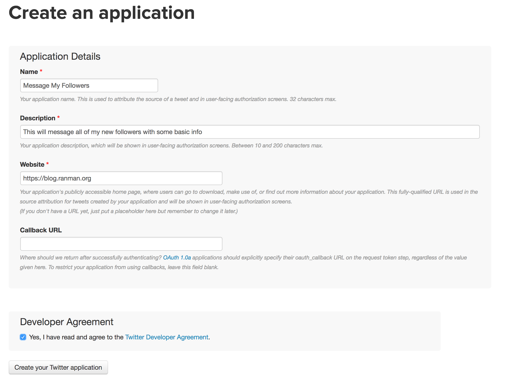
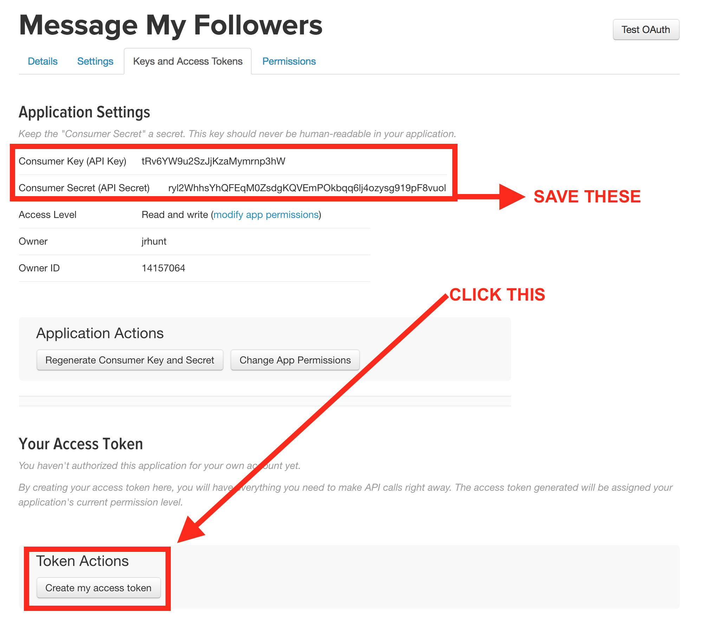
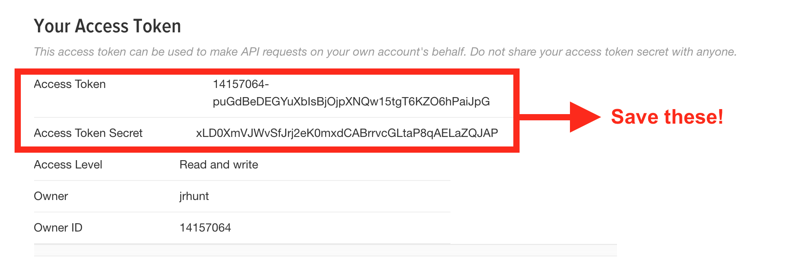
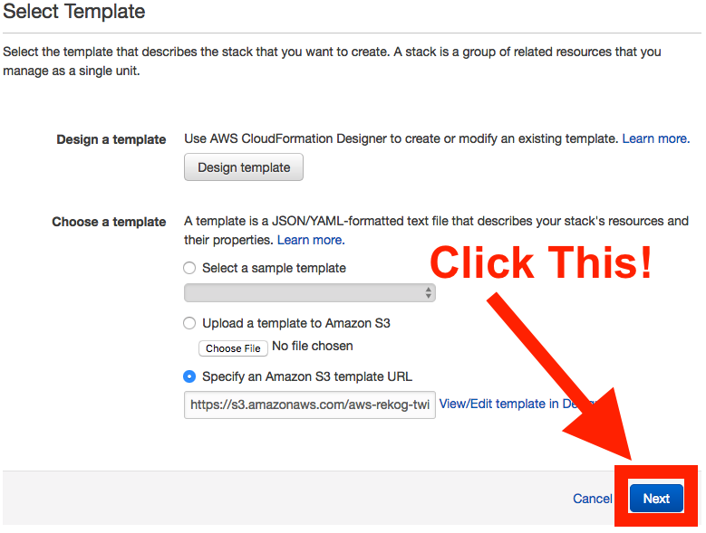
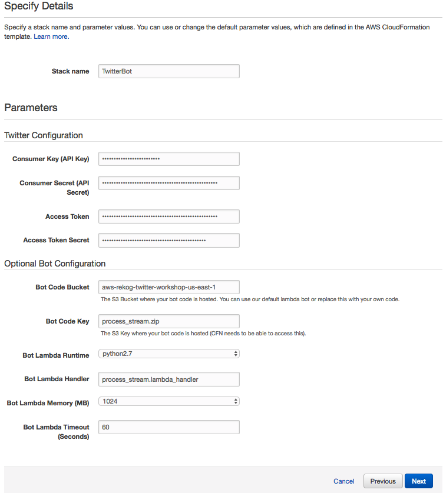

# Build A Rekognition Powered Twitter Bot

# TL;DR How do I 🚀launch🚀 this stack? Click one of these!
Region (that supports Rekognition) | Button
------------ | -------------
us-east-1 | [](https://console.aws.amazon.com/cloudformation/home?region=us-east-1#/stacks/new?stackName=TwitterBot&templateURL=https://s3.amazonaws.com/aws-rekog-twitter-workshop/template-us-east-1.yaml)
us-west-2 | [](https://console.aws.amazon.com/cloudformation/home?region=us-west-2#/stacks/new?stackName=TwitterBot&templateURL=https://s3.amazonaws.com/aws-rekog-twitter-workshop/template-us-west-2.yaml)
eu-west-1 | [](https://console.aws.amazon.com/cloudformation/home?region=eu-west-1#/stacks/new?stackName=TwitterBot&templateURL=https://s3.amazonaws.com/aws-rekog-twitter-workshop/template-eu-west-1.yaml)

### **WARNING**: not all of these resources are within the free-tier
#### Cost Estimate: ~$12/month with ~10 requests per second: [Simple Monthly Calculator](https://calculator.s3.amazonaws.com/index.html#r=IAD&key=calc-C1BFFEDA-A944-472A-9A52-0B57AA3E95CE)


# Overview
### This workshop will allow you to build a twitter bot that modifies images it receives

## Example:
[](https://twitter.com/AWSCloudNinja/status/865568765836185601)

We'll cover the concepts of:

* [Twitter API](https://apps.twitter.com/)
* [AWS Lambda](https://aws.amazon.com/lambda/)
* [Amazon DynamoDB](https://aws.amazon.com/dynamodb/)
* [Amazon S3](https://aws.amazon.com/s3/)
* [Amazon EC2](https://aws.amazon.com/ec2/), [Amazon EC2 SSM](http://docs.aws.amazon.com/systems-manager/latest/APIReference/Welcome.html), AWS Autoscaling, Amazon VPC
* [AWS IAM](https://aws.amazon.com/iam/)
* [AWS CloudFormation](https://aws.amazon.com/cloudformation/)
* Python

To design your own bot you should have a working knowledge of:

* JSON
* Twitter API
* A programming language
* REST APIs
* OAuth


# TOC:
1. Setup Twitter App
2. Launch Stack
3. Send a test tweet
4. How does it all work?
5. Additional Exercises

## Video of setup: [https://youtu.be/cOTZxTJ3pN4](https://youtu.be/cOTZxTJ3pN4)

## Setting up a Twitter App
1. First we need to create a new twitter app by navigating to: [https://apps.twitter.com/](https://apps.twitter.com/)

2. Next we will create a new twitter application


3. Now we'll fill out some info to create that application


4. Next we'll generate some additional credentials for accessing our application as ourselves:


5. Then we'll save all this info somewhere safe!


## Launching The Stack
To setup the lambda function and associated infrastructure we can either use the launch stack button or we can simply
upload this template-{region}.yaml file into the CloudFormation console and have CloudFormation set everything up for us!


Now we go to CloudFormation:


Then we click next and fill out the credentials we saved earlier!



Next we continue to click next and accept and then we launch the stack!

You can walk through the CloudFormation template in detail below:
<details>

### CloudFormation Details:
You can see the template file here: [template-us-east-1.yaml](template-us-east-1.yaml)

#### Preamble
The first section of the CloudFormation template are the `Parameters`. The only required parameters are the Twitter credentials.

The rest of the parameters are for testing and convenience sake (or for when you want to easily deploy your own bot later).

There's a small metadata section that just includes some details on how to render the parameters page.

The final part of the preamble are the Mappings. In this case we just have a simple Region-to-AMI map that gives us a amazon linux instance.

#### Resources

##### S3, Kinesis, and DynamoDB
We create a Kinesis Stream: `AWS::Kinesis::Stream` with a single shard.
We create a DynamoDB (DDB): `AWS::DynamoDB::Table` with some basic attributes.
Now we create two S3 buckets: `AWS::S3::Bucket` one for unprocessed images and one for processed images.

##### Credentials and IAM
Now that we have most of our resources we can create a role for our application: `AWS::IAM::Role`.

We'll give our role an `AssumeRolePolicyDocument` AKA a Trust Policy that allows both Lambda and EC2 instances to assumme this role.

We'll also give our policy access to: x-ray, logging, rekognition, our dynamodb table, and our S3 Buckets.

Finally we also create an SSM Parameter: `AWS::SSM::Parameter` of type `StringList` from the credentials provided in the Parameters section of the template.

##### Lambda Functions
Next we create our lambda function: `AWS::Lambda::Function` and connect it to our kinesis stream through an `AWS::Lambda::EventSourceMapping`.

We also assign this lambda function the IAM role we created above.

##### Infrastructure
We start by declaring a VPC: `AWS::EC2::VPC` with a CIDR Block of `10.0.0.0/16`.

This tells CloudFormation to build us a Virtual Private Cloud with 65536 addresses (2^(32-16)).

Next we build and attach an Internet Gateway (IGW): `AWS::EC2::InternetGateway`.

We create a Route Table: `AWS::EC2::RouteTable`, and populate it with a route to our IGW.

Then we declare 2 subnets: `AWS::EC2::Subnet` of `10.0.0.0/24` and `10.0.1.0/24` with 255 addresses each (2^(32-24)) and in two separate AZs.

Next we associate our route table created above with our 2 subnets.

Now we create an IAM profile to associate with our EC2 instances.

Next we create an AutoScaling Group Launch Configuration: `AWS::AutoScaling::LaunchConfiguration` with some UserData to setup our streaming instance.

Now we associate the LaunchConfiguration with our AutoScaling Group: `AWS::AutoScaling::Group` with a `CreationPolicy` to wait for a signal from our user data on the EC2 instances.

We give our AutoScaling group a desired, min, and max size of 1 but access to two AZs to ensure our ingestion continues during a single AZ outage.
</details>

## Sending A Test Tweet:

It's easy! Just make sure you mention the name of your twitter bot and include a photo and you should get a response:
```
Hey @awscloudninja cloud ninja me and @werner!
```


## How does it all work?

It's really straight forward and all the magic happens in [process_stream.py](lambda_functions/process_stream.py)


## Additional Exercises
1. Change the "mask.png" in the lambda to whatever you want and re-zip and re-upload the lambda function!
1. Can you make this detect beards and rate them (based on confidence value) ?
1. Can you make this bot detect celebrities and return their name (or tag them on twitter!?!) ?
1. Can you make this use Lex instead of rekogntion to respond to users ?


## I want to build this myself:
Run `./build.sh process_stream.zip process_stream.py mask.png` to create the lambda package.

If you've only changed the proccess_stream.py file you can just `zip -9 process_stream.zip process_stream.py`

Upload that package to lambda:
`aws lambda update-function-code --function-name <FUNCTION_NAME> --code s3://<BUCKET>/<KEY>`
